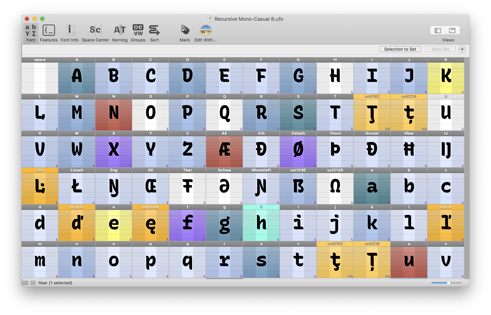
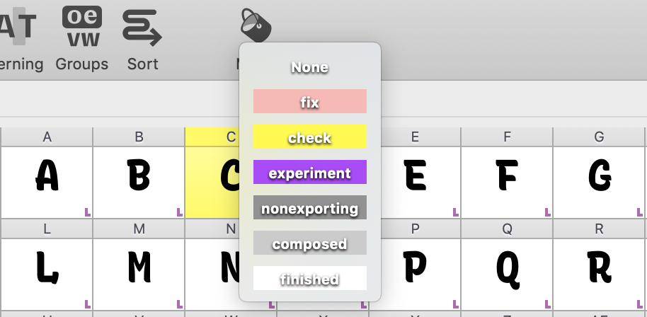

    

<h1 align="center">
  Marx: easily control glyph marks in RoboFont
</h1>

This is an experimental set of scripts to allow easy control over glyph marks in RoboFont.

Use hotkey shortcuts to quickly assign a color mark to selected glyphs, to better visualize the working state of a font and more effectively collaborate with others.

## Installation

1. Download or clone this git repo into your RoboFont scripts folder.
2. In RoboFont, open the Scripts menu, and click `Update Menu` to make the new scripts appear.
3. Select glyphs a font, and click (or use a hotkey) to apply marks!

Note: currently, there are folders for `notes` and `markLib` in the script menu. Please ignore these. :)

## Usage

### Mark glyphs

Select one or more glyphs in the main Font view, and cue one of the following scripts:

| **State**                           | **Color**                          | Shortcut          |
| ----------------------------------- | ---------------------------------- | ----------------- |
| Needs Fixing                        | Red                                | `cmd cntr shft 1` |
| Waiting for Critique                | Yellow                             | `cmd cntr shft 2` |
| Experimental                        | Purple                             | `cmd cntr shft 3` |
| “Non-exporting” (e.g. `.arrowhead`) | Dark Gray                          | `cmd cntr shft 4` |
| Built from Components               | Light Gray                         | `cmd cntr shft 5` |
| Finished / Good                     | White                              | `cmd cntr shft 0` |
| Iteration Increment                 | Teal, greener for more iterations  | `cmd cntr shft =` |
| Iteration Decrement                 | Teal, lighter for fewer iterations | `cmd cntr shft -` |

I recommend [setting up a "Hyper" key](https://brettterpstra.com/2017/06/15/a-hyper-key-with-karabiner-elements-full-instructions/), but leaving out the `option` key, for optimal hotkey usage in RoboFont. The default shortcuts in Marx assume you have done this.

### Update RoboFont mark settings

If you haven't already custom-configured your RoboFont mark settings (or if you are okay to override previous customizations), you can use `Override & update global RoboFont mark settings` to override the mark settings. This will make it easy to mark glyphs with the correct colors & mark names, directly in the RoboFont UI.

### Select all glyphs with a particular mark

Sometimes, it's useful to select all glyphs with a certain mark (or marks).

In the main font view, select a glyph (or glyphs) with the mark (or marks) you want to select, then use `Select all glyphs with selected marks` to select all similarly-marked glyphs.

Example usecase: you have a bunch of glyphs marked in orange, but you want to mark them as components (gray). Select a single orange glyph, then run this script, then run the "Built from components" mark script.

## To-do

- [ ] Adjust `increment` colors in all WIP glyphs when one reaches a new maximum value
- [ ] Make it simpler to set mark while in glyph-edit view

Maybe:
- [ ] Make into an extension, with UI for simpler control and configuration
