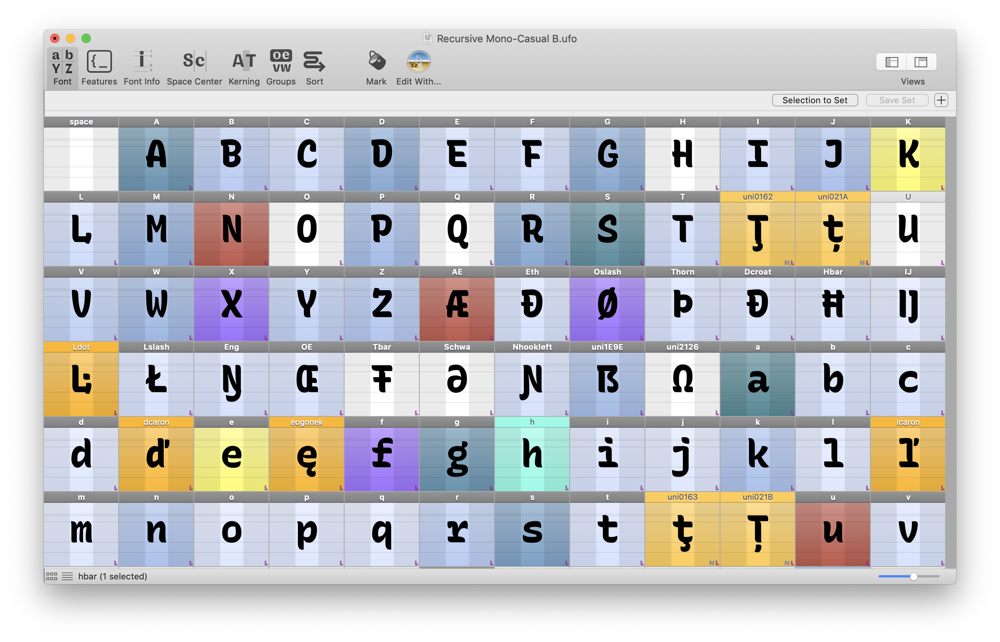

    

<h1 align="center">
  Marx: easily control glyph marks in RoboFont
</h1>

This is an experimental set of scripts to allow easy control over glyph marks in RoboFont.

Use hotkey shortcuts to quickly assign a color mark to selected glyphs, to better visualize the working state of a font and more effectively collaborate with others.

## Usage

I recommend [setting up a "Hyper" key](https://brettterpstra.com/2017/06/15/a-hyper-key-with-karabiner-elements-full-instructions/), but leaving out the `option` key, for optimal hotkey usage in RoboFont. The default shortcuts in Marx assume you have done this.

| **State**                           | **Color**                          | Shortcut          |
| ----------------------------------- | ---------------------------------- | ----------------- |
| Iteration Increment                 | Teal, darker for more iterations   | `cmd+cntr+shft+=` |
| Iteration Decrement                 | Teal, lighter for fewer iterations | `cmd+cntr+shft+-` |
| Finished / Good                     | (none)                             | `cmd+cntr+shft+0` |
| Needs Fixing                        | Red                                | `cmd+cntr+shft+1` |
| Waiting for Critique                | Yellow                             | `cmd+cntr+shft+2` |
| Experimental                        | Purple                             | `cmd+cntr+shft+3` |
| “Non-exporting” (e.g. `.arrowhead`) | Gray                               | `cmd+cntr+shft+4` |
| Built from Components               | Blue                               | `cmd+cntr+shft+5` |

## To-do

- [ ] Adjust `increment` colors in all WIP glyphs when one reaches a new maximum value

Maybe:
- [ ] Make into an extension, with UI for simpler control and configuration
